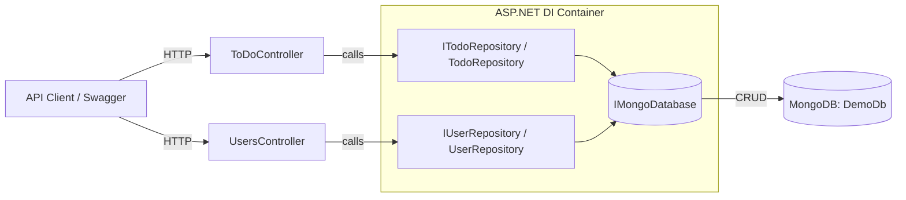

# ASP.NET + MongoDB ToDo API

A simple **ASP.NET Core Web API** connected to **MongoDB**, built for learning.  
Supports CRUD for **Users** and **ToDo tasks**, with the ability to assign each task to a single user.

---

## 🚀 Features

- ASP.NET Core Web API (controller-based)
- MongoDB for persistence
- Repository pattern with dependency injection
- Swagger UI for testing endpoints
- Users can be created and assigned to tasks
- Tasks support CRUD + assignment

---

## 📦 Prerequisites

- [.NET 8 SDK](https://dotnet.microsoft.com/download)
- [Docker Desktop](https://www.docker.com/products/docker-desktop)
- MongoDB Compass (optional, for browsing DB)

---

## ⚙️ Setup

### 1. Run MongoDB in Docker

```bash
docker network create appnet

docker run -d \
  --name mongodb \
  --network appnet \
  -p 27017:27017 \
  -e MONGO_INITDB_ROOT_USERNAME=root \
  -e MONGO_INITDB_ROOT_PASSWORD=example \
  -v mongo_data:/data/db \
  mongo:7
```

## Architecture


